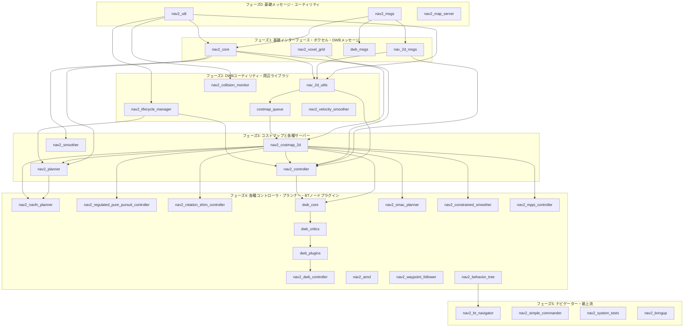

# Navigation2 全パッケージ Bazel 移行ロードマップ & 難易度評価プラン

本ドキュメントは、`nav2_map_server` で確立された Bazel（WORKSPACE 形式）ビルド手法を基に、ROS 2 Humble に含まれるその他の **Navigation2 (Nav2) 全パッケージ**を Bazel ビルドへ移行するための詳細な調査結果、難易度評価、および移行手順のロードマップをまとめたものです。

---

## 1. 移行の基本戦略（`map_server` での確立手法の横展開）

`map_server` の移行で得られた以下の設計パターンを他のパッケージにも適用します。

1. **`rules_ros2` の利用**: 
   メッセージ自動生成（`ros2_interface_library`）や ROS 2 コアライブラリ（`rclcpp` 等）の依存解決には、引き続き `rules_ros2` を使用します。
2. **システム依存解決の共通化 (`system_sdk.bzl`)**: 
   非ROSパッケージや外部のC++ライブラリ（Eigen, OpenCV, Ceres, BehaviorTree 等）は、開発コンテナ内のシステムパス（`/usr` や `/opt/ros/humble`）から `system_sdk.bzl` を用いてシンボリックリンクを張り、Bazel ターゲットとして公開します。
3. **共有ライブラリとプラグイン**: 
   Nav2 は多くのプラグイン（`pluginlib` 経由）で構成されています。これらは `ros2_cpp_library` (実質 `cc_library`) を用いて `.so`（共有ライブラリ）としてビルドし、Bazel の `runfiles` 機構を利用して実行時に動的ロードできるようにします。

### 1.1 ビルド成果物の等価性評価基準
本プロジェクトにおけるBazelへの移行成否は、**「colconでビルドした際の成果物と同じファイル（実行バイナリ、共有ライブラリ、ヘッダー、メッセージ定義など）を過不足なくBazelで生成できるか？」**を絶対的な基準として判断します。

具体的には、以下の観点でビルド結果の検証を行います：
* **実行可能バイナリ (Executables)**: colconで生成される各バイナリ（例: `amcl`, `map_server`, `planner_server` 等）が、Bazelでも実行可能なバイナリ（`bazel-bin/` 以下）として同等にビルドされ、動作に不可欠な共有ライブラリへのシンボルリンクが解決されていること。
* **共有ライブラリ / プラグイン (Shared Libraries & Plugins)**: `pluginlib` で動的ロードされる共有ライブラリ（`.so`）がすべてビルドされ、`runfiles` 機構によって適切なパス配置と参照が再現されていること。
* **インターフェース定義 (Messages/Services/Actions)**: `.msg`, `.srv`, `.action` ファイルから自動生成されるC++ヘッダー群が漏れなく生成され、依存するC++ターゲットからインクルードできること。
* **アセット・ローンチファイル等**: 各種設定ファイル（`.yaml`等）やローンチファイル等のリソースファイルが、Bazelの実行時環境（`data` 属性等）から問題なく読み込める状態であること。

### 1.2 非侵襲的（Non-invasive）移行方針
元の `navigation2` ディレクトリ内のファイルを直接修正・汚染することを避けるため、以下の非侵襲的方針を徹底します。

1. **ソースコードの直接修正の禁止とパッチの切り出し**:
   * **一時的な直接編集と検証**: 開発・検証の過渡期（ビルドが正常に通るようになるまで）は、元の `src/navigation2` のソースコードを一時的に直接修正することを許容します。
   * **パッチの生成とクリーン化**: ビルドが成功した段階で、`git diff` を用いて修正内容をパッチファイル（`.patch`）として切り出し、`patches/` ディレクトリ下で管理します。その後、元のソースコードは `git checkout` や `git reset` 等でクリーンな状態に戻します。
   * **パッチの自動適用**: ビルド時には、`WORKSPACE` 内の `new_local_repository`（または `http_archive` 等）の `patches` 属性、あるいはビルドルールによって自動的にパッチが適用される仕組みを構築します。
2. **Bazel設定ファイルの外部配置 (案Bを採用)**:
   * `src/navigation2` フォルダ以下には `BUILD.bazel` や `WORKSPACE` などのBazel設定ファイルを一切配置しません。
   * 各パッケージに対して、個別の外部 `BUILD` ファイル（例: `3rdparty/bazel/nav2_amcl.BUILD`）を作成し、元のディレクトリの外側で管理します。
   * `WORKSPACE` ファイル内で `new_local_repository` を定義し、以下のように `build_file` 属性を用いて外側から `BUILD` ファイルをマッピングします。
     ```starlark
     new_local_repository(
         name = "nav2_amcl",
         path = "src/navigation2/nav2_amcl",
         build_file = "//3rdparty/bazel:nav2_amcl.BUILD",
     )
     ```

---

## 2. 外部（非ROS）依存関係の整理と解決策

Nav2 の各パッケージが依存する、ROS 標準以外の主要な外部ライブラリと、Bazel における解決アプローチを以下に整理します。

| 外部ライブラリ | 主な依存パッケージ | Bazel での解決アプローチ |
| :--- | :--- | :--- |
| **`behaviortree_cpp_v3`** | `nav2_behavior_tree`<br>`nav2_bt_navigator` | `/opt/ros/humble/include/behaviortree_cpp_v3` と `/opt/ros/humble/lib/libbehaviortree_cpp_v3.so` を `system_sdk.bzl` に追加。 |
| **`Eigen3`** | `nav2_costmap_2d`<br>`nav2_smac_planner`<br>`nav2_mppi_controller` | `/usr/include/eigen3` を `system_sdk.bzl` で symlink し、ヘッダーオンリーの `cc_library` として定義。 |
| **`xtensor` / `xsimd`** | `nav2_mppi_controller` | apt で入るヘッダーオンリーライブラリ。`/usr/include/xtensor` 等を `system_sdk.bzl` 経由で公開。 |
| **`OpenCV`** | `nav2_waypoint_follower` | `/usr/include/opencv4` および `/usr/lib/x86_64-linux-gnu/libopencv_*.so` 群を `system_sdk.bzl` でラップ。 |
| **`Ceres` / `SuiteSparse`** | `nav2_constrained_smoother` | `/usr/include/ceres` / `/usr/include/suitesparse` と対応する `.so` ライブラリ群を `system_sdk.bzl` に追加。 |
| **`Qt5` (Core/Gui/Widgets)** | `nav2_rviz_plugins` | Bazel で Qt ビルドを組むのは極めて困難なため、`/usr/include/x86_64-linux-gnu/qt5` から必要なヘッダーと `.so` を参照させる。 |

---

## 3. 全パッケージの移行難易度・依存関係評価

各パッケージのコード規模、外部依存、およびプラグイン構造に基づき、難易度を 4 段階（**低 / 中 / 高 / 極めて高**）で評価します。

### 📊 難易度サマリーテーブル

| パッケージ名 | 難易度 | 主要な依存先 | 移植における主な障壁・ポイント |
| :--- | :--- | :--- | :--- |
| **`nav2_common`** | ➖ (不要) | なし | CMake用のビルドヘルパー群であるため、Bazel移行自体が不要。 |
| **`nav2_core`** | **低 (Low)** | `rclcpp`, `geometry_msgs` | インターフェース定義（純粋仮想関数）のヘッダーのみ。 |
| **`nav2_voxel_grid`** | **低 (Low)** | `rclcpp` | 3Dボクセルグリッドの内部実装。ROSへの依存度が低くプレーンなC++。 |
| **`nav2_lifecycle_manager`** | **低 (Low)** | `nav2_util`, `lifecycle_msgs` | ライフサイクル管理ロジック。標準ROS 2 APIのみで記述。 |
| **`nav2_velocity_smoother`** | **低 (Low)** | `rclcpp`, `geometry_msgs` | 速度コマンドのスムージング処理。外部依存がほぼない。 |
| **`nav2_msgs`** | ✅ (移行済) | - | メッセージ定義パッケージ。すでに移行に成功しています。 |
| **`nav2_util`** | ✅ (移行済) | - | 基本ユーティリティ。すでに移行に成功しています。 |
| **`nav2_map_server`** | ✅ (移行済) | - | 地図配信。すでに移行に成功しています。 |
| **`nav2_waypoint_follower`** | **中 (Medium)** | `nav2_util`, OpenCV | ウェイポイント追従。OpenCVのBazel定義が必要。 |
| **`nav2_collision_monitor`** | **中 (Medium)** | `rclcpp`, `tf2_ros` | 衝突安全監視。多角形衝突判定ロジックを含む。 |
| **`nav2_amcl`** | **中 (Medium)** | `nav2_util`, 自前 `pf_lib` | 自己位置推定。内部サブディレクトリ `src/pf` 等のライブラリビルドが必要。 |
| **`nav2_navfn_planner`** | **中 (Medium)** | `nav2_core`, `nav2_util` | Dijkstra/A*を用いた単純なプランナー。プラグイン定義が必要。 |
| **`nav2_regulated_pure_pursuit_controller`** | **中 (Medium)** | `nav2_core`, `nav2_util` | 追従制御（RPP）。アルゴリズムコードがメイン。 |
| **`nav2_rotation_shim_controller`** | **中 (Medium)** | `nav2_core`, `nav2_util` | 回転シム制御。他のコントローラをラップする構造。 |
| **`nav2_planner`** | **高 (High)** | `pluginlib`, `nav2_core`, `nav2_costmap_2d` | プランナーサーバー。プラグインを動的ロードするため Bazel 側のリンク設定が重要。 |
| **`nav2_controller`** | **高 (High)** | `pluginlib`, `nav2_core`, DWB依存 | コントローラーサーバー。プラグイン動的ロードの解決が必要。 |
| **`nav2_smoother`** | **高 (High)** | `pluginlib`, `nav2_core` | スムーサーサーバー。プラグイン動的ロードの解決が必要。 |
| **`nav2_costmap_2d`** | **高 (High)** | `Eigen3`, `nav2_voxel_grid` | 2D/3Dコストマップ。複数レイヤープラグインのビルド、Eigen3依存。 |
| **`nav2_smac_planner`** | **高 (High)** | `Eigen3`, `OpenMP` | 高度なプランナー。OpenMPマルチスレッド設定が必要。 |
| **`nav2_constrained_smoother`** | **高 (High)** | `Ceres`, `SuiteSparse` | 経路最適化。Ceres Solver のリンク解決が必要。 |
| **`nav2_mppi_controller`** | **高 (High)** | `xtensor`, `xsimd` | MPPI制御。SIMD（xsimd）と多次元配列（xtensor）のビルド設定。 |
| **`nav2_behavior_tree`** | **高 (High)** | `behaviortree_cpp_v3` | 膨大な数のBTノード共有ライブラリプラグイン（40以上）のビルド。 |
| **`nav2_bt_navigator`** | **高 (High)** | `nav2_behavior_tree` | BTエンジンとナビゲーター本体。挙動ツリーのファイルロードパス解決。 |
| **`nav2_dwb_controller`** | **高 (High)** | `nav_2d_utils` などのサブパッケージ | DWB (Dynamic Window Approach) 関連で、複数サブパッケージ間の相互参照。 |
| **`nav2_rviz_plugins`** | **極めて高 (Very High)**| `Qt5`, `rviz_common` | RViz2とのC++連携。QtのMOCやUIファイルのビルドが必要で、Bazel移行は非推奨。 |
| **`nav2_system_tests`** | **高 (High)** | テスト対象パッケージ群 | システム全体のテスト。Bazelのサンドボックス上でのROS 2ノード間通信テストの構成。 |

---

## 4. 各難易度グループの詳細分析と移行アプローチ

### 🟢 難易度: 低 (Low) のパッケージ
* **対象**: `nav2_core`, `nav2_voxel_grid`, `nav2_lifecycle_manager`, `nav2_velocity_smoother`
* **特徴**:
  * インターフェースや純粋なC++数学モデルなど、依存関係が単純である。
  * 外部の非標準ライブラリ（CeresやBehaviorTreeなど）に依存していない。
* **アプローチ**:
  * 外部の `BUILD` ファイル（`3rdparty/bazel` 配下）で `ros2_cpp_library` ターゲットを素直に記述する。
  * `nav2_core` はヘッダーのみであるため、`hdrs` と `includes` を適切に設定する。

### 🟡 難易度: 中 (Medium) のパッケージ
* **対象**: `nav2_waypoint_follower`, `nav2_collision_monitor`, `nav2_amcl`, 各種プラグインアルゴリズム単体 (`nav2_navfn_planner` 等)
* **特徴**:
  * Eigen や OpenCV などの一般的な外部ライブラリを部分的に使用する。
  * `nav2_amcl` のように、パッケージ内部がいくつかのサブライブラリ（`pf`, `motion_model` 等）に分かれている。
* **アプローチ**:
  * OpenCV などのシステムライブラリは、`system_sdk.bzl` でヘッダーインクルードと `.so` のリンクを定義して対応。
  * 内部構造の分割は、外部BUILD内で複数の `cc_library` を定義してリンク順序を整理する。

### 🔴 難易度: 高 (High) のパッケージ
* **対象**: `nav2_planner`, `nav2_controller`, `nav2_costmap_2d`, `nav2_behavior_tree` 関連, `nav2_mppi_controller` 等
* **特徴**:
  * `pluginlib` を用いて、別パッケージでビルドされたプラグイン（共有ライブラリ）を動的にロードするサーバーノードである。
  * `behaviortree_cpp_v3` や `xtensor/xsimd`, `Ceres` といった専門的な外部パッケージに依存している。
  * プラグインの XML メタデータ（`plugins.xml` 等）を ROS 2 のランタイムに知らせる必要がある。
* **アプローチ**:
  * **プラグインロード問題**: 実行バイナリ（例: `planner_server`）の `deps` または `data` 属性にプラグインの共有ライブラリ（例: `libnav2_navfn_planner.so`）を紐付け、`runfiles` を通じてロードできるように設定。
  * **専門ライブラリ**: `system_sdk.bzl` に `behaviortree_cpp_v3` や `xtensor` のルールを追加。

### ❌ 難易度: 極めて高 (Very High) のパッケージ (対象外 / 別途検討)
* **対象**: `nav2_rviz_plugins`
* **特徴**:
  * Qt5/Qt6 の GUI フレームワークに依存し、さらに RViz2 の C++ API と静的・動的リンクする。
  * Qt 固有のコード生成器 (MOC: Meta-Object Compiler, UIC: User Interface Compiler) を Bazel 上で実行するルール設定が必要。
* **アプローチ**:
  * Qt5/Qt6 を Bazel 上でビルドするのは極めて難易度が高いため、このパッケージに関しては **Bazel 移行の対象外（または colcon でのビルドを維持）** とすることを推奨します。

---

## 5. 推奨する移行ロードマップ（6フェーズ）

移行の依存関係（下流から上流へ）と難易度を考慮し、トポロジカルソート（依存解決順）に基づいた以下の 6 フェーズで順次ビルドターゲットを拡大していく計画を提案します。



### 📅 各フェーズの実行内容

#### 【フェーズ 0: 基礎メッセージ・ユーティリティ】（完了済み）
* **目標**: 他のすべてのパッケージが依存するメッセージ定義と基礎ユーティリティを確立する。
* **対象**: `nav2_msgs`, `nav2_util`, `nav2_map_server`
* **状況**: すでにBazel移行が成功しています。

#### 【フェーズ 1: 基礎インターフェース・ボクセル・DWBメッセージ】
* **目標**: 最下流にある純粋なインターフェース（C++ヘッダー）と、DWBの前提となるメッセージ定義をビルド可能にする。
* **対象**: `nav2_core`, `nav2_voxel_grid`, `dwb_msgs`, `nav_2d_msgs`
* **作業内容**:
  * 各パッケージの外部BUILDファイルを `3rdparty/bazel/` に定義。
  * `dwb_msgs` および `nav_2d_msgs` に対する `ros2_interface_library` の適用。

#### 【フェーズ 2: DWBユーティリティ・周辺ライブラリ】
* **目標**: コストマップやコントローラが参照するユーティリティ層、および周辺の独立したノードを移行する。
* **対象**: `nav_2d_utils`, `costmap_queue`, `nav2_lifecycle_manager`, `nav2_velocity_smoother`, `nav2_collision_monitor`
* **作業内容**:
  * `nav_2d_utils` は `nav_2d_msgs` 和 `nav2_util` に依存するため、フェーズ1の成果を受けてビルド。
  * `costmap_queue` は `nav_2d_utils` に依存するライブラリ。
  * 周辺ノードの `BUILD` 定義。

#### 【フェーズ 3: コストマップと各種サーバー】
* **目標**: ナビゲーションの主軸となるコストマップと、プラグインをロードする側のコアサーバー群を構築する。
* **対象**: `nav2_costmap_2d`, `nav2_planner`, `nav2_controller`, `nav2_smoother`
* **作業内容**:
  * `nav2_costmap_2d` に必要な `Eigen3` 依存を `system_sdk.bzl` にて解決。
  * `nav2_controller` が `nav_2d_utils` および `nav_2d_msgs` をリンクするように設定。
  * プラグインを動的に解決するサーバーノードのビルド設定。

#### 【フェーズ 4: 各種コントローラ・プランナー・BTノードプラグイン】
* **目標**: プラグインとしてサーバーからロードされる各種アルゴリズム（DWB、AMCL、RPP、BTノードなど）を移行する。
* **対象**: 
  * **プランナー系**: `nav2_navfn_planner`, `nav2_smac_planner` (Eigen, OpenMP依存)
  * **コントローラ系**: `nav2_regulated_pure_pursuit_controller`, `nav2_rotation_shim_controller`, DWB関連 (`dwb_core`, `dwb_critics`, `dwb_plugins`, `nav2_dwb_controller`)
  * **ローカリゼーション**: `nav2_amcl` (内部 pf_lib を持つ)
  * **経路最適化**: `nav2_constrained_smoother` (Ceres依存)
  * **高度数値計算**: `nav2_mppi_controller` (xtensor/xsimd依存)
  * **振る舞い定義**: `nav2_behavior_tree` (behaviortree_cpp_v3依存、大量のBTプラグインビルド)
* **作業内容**:
  * OpenCV, Ceres, BehaviorTree などの外部システム依存の解決。
  * 各アルゴリズムプラグインを共有ライブラリ（`.so`）としてコンパイル。

#### 【フェーズ 5: ナビゲーター・最上流】
* **目標**: 最も上流にある振る舞い制御（BT Navigator）と、テスト、システム全体のローンチ、Python APIをビルド・実行可能にする。
* **対象**: `nav2_bt_navigator`, `nav2_simple_commander`, `nav2_system_tests`, `nav2_bringup`
* **作業内容**:
  * `nav2_bt_navigator` は `nav2_behavior_tree` や `behaviortree_cpp_v3` に完全に依存するため、ここでの移行。
  * `nav2_simple_commander` (Python API) のビルド。
  * サンドボックス上でのテスト環境（`nav2_system_tests`）の構成。
